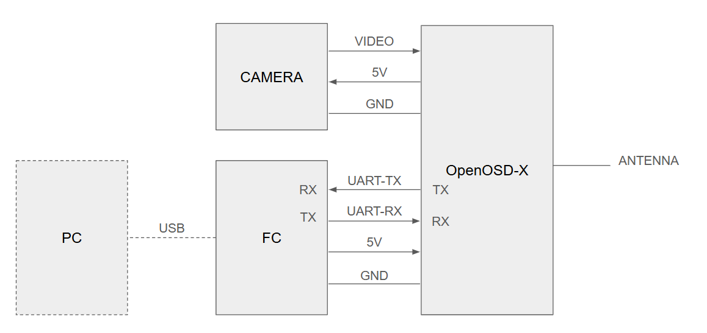

<p align="right">
  <a href="./README_jp.md">日本語はこちら</a>
</p>

# OpenOSD-X

**OpenOSD-X** is a project that integrates analog OSD and VTX functionality.

## Features

* Enables 5.8GHz analog video output when combined with a digital-only flight controller (without analog OSD)
* Provides both **SD version** (same resolution as MAX7456) and **HD version** (supports more information display)
* Font updates via Betaflight Configurator (planned support)
* Uses the compact and cost-effective **STM32G431KBT**, allowing standalone OSD operation

### Development in Progress

[](https://youtu.be/yP9opvcfM-8)
[](https://youtu.be/Voa65tm_uUc?si=CIwmTUJLayKtx44Y&t=2)

---

## Connection Example



---

## Configuration

1. Connect the camera, OpenVTX, FC, and PC
2. Power all devices

   * USB power alone may not be sufficient; connect a battery if required
3. Launch Betaflight Configurator
4. Serial Port Setup

   * Set the port connected to OpenOSD-X to **VTX (MSP+DisplayPort)**
   * Power cycle all devices to read OSD and VTX parameters
5. OSD Settings

   * Select **HD** (not NTSC/PAL)
   * Resolution is automatically configured depending on the camera and firmware
6. VTX Settings

   * VTX table is preloaded in OpenOSD-X and set automatically
   * Configure channel and output power

---

## Firmware Update
Firmware updates are possible via FC (Serial-Passthrough) or USB-Serial (FTDI).

1. Connect the OpenVTX board, FC, and PC
2. Run the Python script (auto-detects COM port and flashes firmware):

   ```bash
   python flashOpenOSD-X.py hex-file
   ```

   ⚠ Requires Betaflight serial port (DisplayPort-VTX) to be enabled

---

## HEX Files

Latest HEX files are available here:
[https://github.com/OpenOSD-X/OpenOSD-X/actions](https://github.com/OpenOSD-X/OpenOSD-X/actions)

Releases are provided per board type and resolution:

* `openosd-x_breakoutboard_sd.hex` …… Standard resolution for breakout board
* `openosd-x_breakoutboard_hd.hex` …… High resolution for breakout board

---

# Developer Information

## Reference Schematics and Block Diagrams

[https://github.com/OpenOSD-X/OpenOSD-X/tree/main/doc](https://github.com/OpenOSD-X/OpenOSD-X/tree/main/doc)

## Testing with Development Boards

The OSD portion can be tested on ST Nucleo or WeACT development boards.
OpenOSD-X targets the STM32G431KBT but also works with STM32G431C and STM32G473.

## Initial Flashing

Flash the following two HEX files using ST-LINK or similar:

* Application firmware: `openosd-x_***.hex`
* Bootloader: `openosd-x_bootloader.hex`

## VPD Table

The VPD table configures the PA for the VTX.
If VTX is not used, this table is unnecessary.

Example (for breakout board):

|               | 5600MHz | 5650MHz | 5700MHz | 5750MHz | 5800MHz | 5850MHz | 5900MHz | 5950MHz | 6000MHz |
| ------------- | ------- | ------- | ------- | ------- | ------- | ------- | ------- | ------- | ------- |
| 14dBm (25mW)  | 1300mV  | 1330mV  | 1345mV  | 1400mV  | 1480mV  | 1590mV  | 1670mV  | 1710mV  | 1760mV  |
| 20dBm (100mW) | 1910mV  | 1970mV  | 1980mV  | 2120mV  | 2270mV  | 2430mV  | 2540mV  | 2620mV  | 2750mV  |

When manufacturing a custom board, you must create a VPD table tailored to your PA and component selection.
Use the **dev firmware** to measure and generate the required VPD table.

---

## Development Firmware

Used for TX adjustment and VPD table generation.

### Setup

```text
[PC (Terminal)] --- UART (115200bps) --- [OpenOSD-X (dev version)] --- 5.8GHz --- [Measuring Equipment]
```

### Command Example

```text
> vtx_set 5800 1000    ...... Example: 5800MHz, VPD target voltage = 1000mV
```

Adjust the VPD target voltage until the desired TX output is achieved.
The collected values form the VPD table.

---

## Developers Channel

Join the dedicated Discord server:
[https://discord.gg/YtnWQyGRB6](https://discord.gg/YtnWQyGRB6)

## Open Source

OpenOSD-X is open-source software provided free of charge and without warranty.
Parts of the source code are based on the following projects:

* betaflight
* OpenVTx
* OpenPixelOSD

